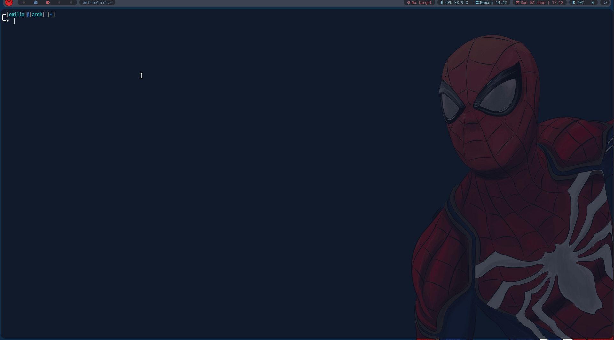

# Qtile Target Widget

### Description
The `target.py` file is a command that receives a target IP and updates a TextBox widget.

### Requirments
Define a TextBox widget inside the `config.py`

### Usage
1. Add `target.py` to `/usr/local/bin`
2. Give the file execute permissions:
    ```sh
    chmod +x target.py
    ```

### Example of usage


### Advice
Once you reload Qtile the target turn back to the default text you set on the TextBox
